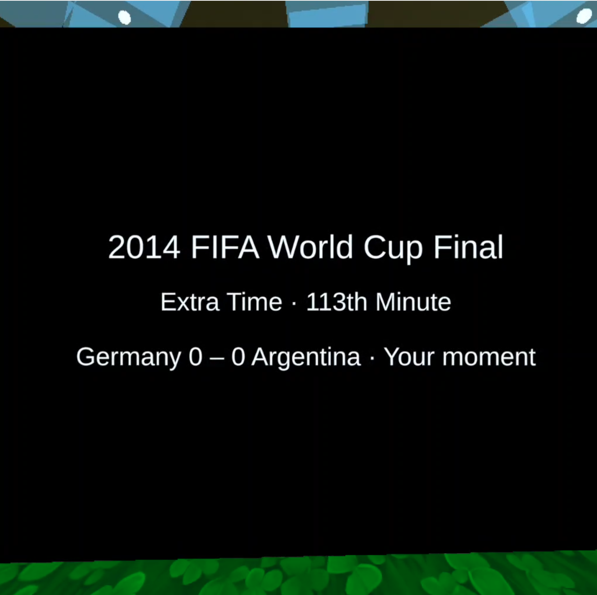
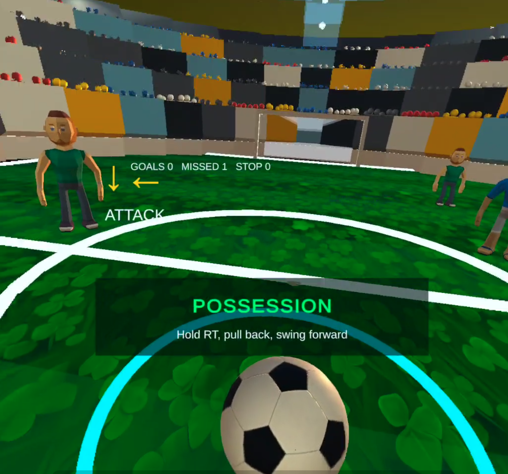
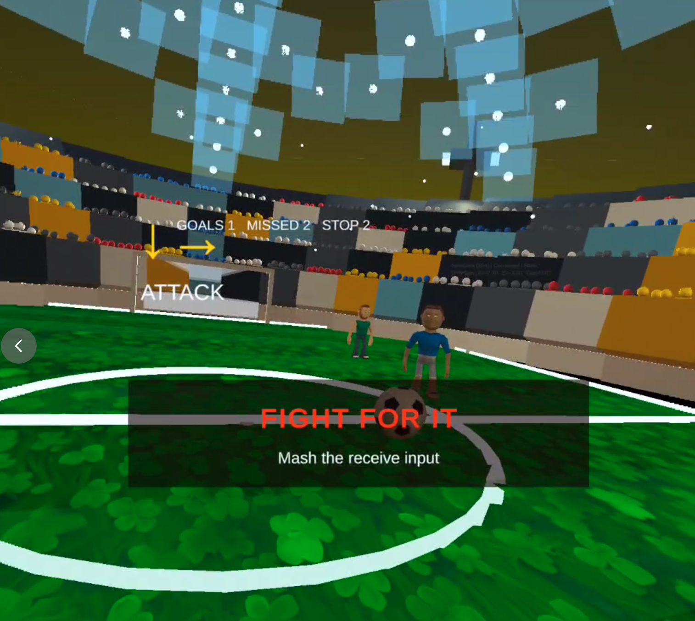

# SoccerBot - VR 足球机器人 AI 推演沙盒

> 面向大学生创新创业比赛的原型项目：真实/模拟机器人触发来球，Unity 负责比赛推演，Meta Quest 3S 提供沉浸式观看与交互。

## 项目定位

SoccerBot 的目标是把真实足球机器人训练中昂贵、危险、难复现的对抗场景，压缩成一个可以反复练习和演示的 VR 训练沙盒。

一句话版本：机器人发起来球，玩家在 VR 中接球、对抗、射门，系统根据动作质量给出结果演出和评分。

## 项目画面



| 持球阶段 | 传球阶段 |
|------|------|
|  |  |

## 当前核心循环

1. 真实机器人或 `FakeDataGenerator` 触发来球。
2. Unity 在 `Pass` 阶段生成虚拟球轨迹。
3. 玩家在接球窗口内按下接球输入，系统根据时机和朝向计算接球质量。
4. 接球质量足够时进入持球阶段，玩家可以蓄力射门。
5. 接球质量过低时进入 `Recovery` 反抢阶段，通过连续按键把球抢回来。
6. 射门结果交给 `ScenarioPlayer` 播放成功、被拦截或射偏等演出，并通过 UI 结算。

## 本次玩法更新

- `FPSPlayerController` 新增接球输入事件 `OnReceiveAttempt` 和 `ReceptionEnabled` 阶段开关。
- `MatchFlowController` 新增 `Recovery` 比赛阶段。
- 传球过程中记录飞行进度，并用接球时机和玩家朝向计算接球质量。
- 接球差时不再直接结束，而是进入限时连按反抢。
- 反抢阶段包含危险边框、按键提示、计数进度、镜头震动、对手击退/前压和争球位置反馈。
- 接球质量会给后续射门蓄力结果增加奖励或惩罚。

更完整的设计说明见 [docs/CORE_GAMEPLAY_REWORK.md](docs/CORE_GAMEPLAY_REWORK.md)。

## 输入方式

| 场景 | 输入 |
|------|------|
| PC 接球 / 反抢 | `Space` 或鼠标左键 |
| Quest 接球 / 反抢 | 左右手柄 `grip`，接球阶段也支持右手 `trigger` |
| PC / Quest 射门 | 保留现有蓄力释放逻辑 |
| 调试视角 | 保留现有键鼠和相机切换逻辑 |

## 系统组成

| 模块 | 说明 |
|------|------|
| 机器人端 | 真实机器人或模拟数据源，负责发起来球事件 |
| Unity 推演端 | 接收来球、生成球路、处理接球/反抢/射门、播放结果 |
| Meta Quest 3S | VR 观看与交互目标设备 |
| Scenario 系统 | 维护结果演出资源，负责回放和评分呈现 |

## 技术栈

| 层级 | 技术 |
|------|------|
| 游戏引擎 | Unity 6000.4.7f1 |
| 渲染管线 | URP |
| VR / XR | XR Interaction Toolkit、XR Management、Oculus XR |
| 通信 | NetworkTables v4 / 本地 FakeData |
| 机器人控制 | WPILib / C++ |
| 部署 | Meta Quest Developer Hub sideload |

## 快速开始

1. 使用 Unity 6000.4.7f1 打开 [unity](unity/) 项目。
2. 打开 `Assets/Scenes/Main.unity`。
3. 在 Editor 中 Play，使用 `FakeDataGenerator` 无机器人调试来球。
4. 传球飞来时按 `Space` 或鼠标左键接球。
5. 如果接球失败，继续疯狂按同一个键完成反抢。
6. 持球后按现有射门输入蓄力并释放。

连接真实机器人时，在 [NTManager.cs](unity/Assets/Scripts/Core/NTManager.cs) 中配置 RoboRIO / NetworkTables 地址，并切换到真实数据源。

## 目录结构

```text
SoccerBot/
├─ README.md
├─ PLAN.md
├─ docs/
│  ├─ CORE_GAMEPLAY_REWORK.md
│  └─ images/
│     ├─ intro.png
│     ├─ possession.png
│     └─ pass.png
├─ robot/
└─ unity/
   └─ Assets/
      ├─ Scenes/
      └─ Scripts/
         ├─ Ball/
         ├─ Camera/
         ├─ Core/
         ├─ Effects/
         ├─ Field/
         ├─ Flow/
         ├─ Player/
         ├─ Robot/
         ├─ Scenario/
         ├─ Simulation/
         ├─ SmartBall/
         ├─ UI/
         └─ XR/
```

## 关键脚本

- [MatchFlowController.cs](unity/Assets/Scripts/Flow/MatchFlowController.cs)：比赛阶段、传球、接球质量、Recovery 反抢和结果路由。
- [FPSPlayerController.cs](unity/Assets/Scripts/Player/FPSPlayerController.cs)：PC / Quest 输入、接球事件、蓄力射门和移动控制。
- [ScenarioPlayer.cs](unity/Assets/Scripts/Scenario/ScenarioPlayer.cs)：结果演出播放。
- [FakeDataGenerator.cs](unity/Assets/Scripts/Simulation/FakeDataGenerator.cs)：无真实机器人时的本地调试数据。

## 当前状态

截至 2026-06-06，项目已经从“观看预设脚本演出”推进到“玩家接球决定结果”的可玩原型。下一步建议优先在 PC Editor 和 Quest 3S 上调手感参数，包括接球窗口、反抢目标次数、HUD 可读性和射门奖励/惩罚幅度。
